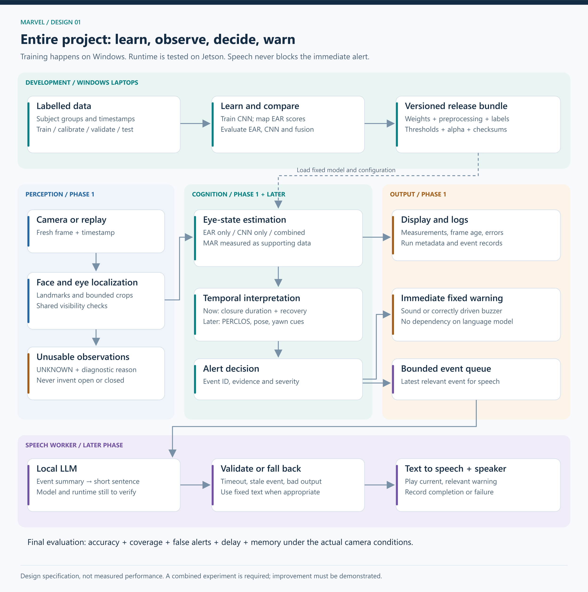
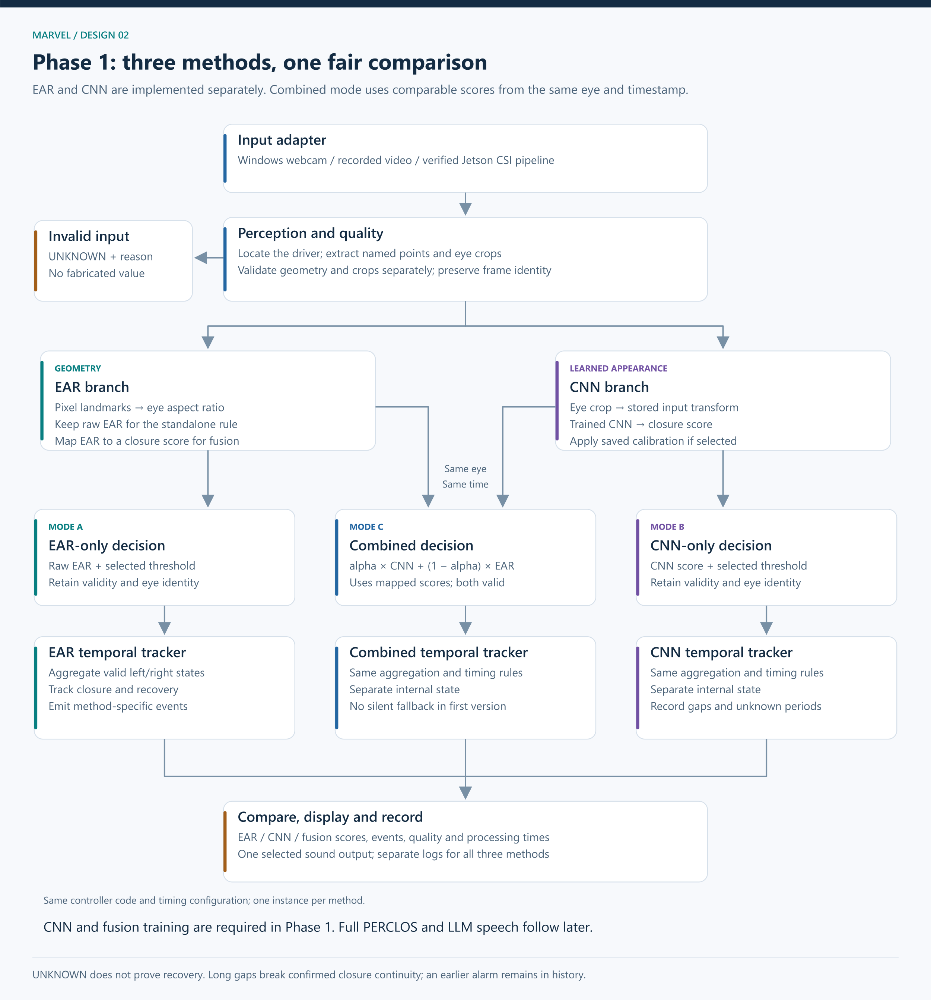
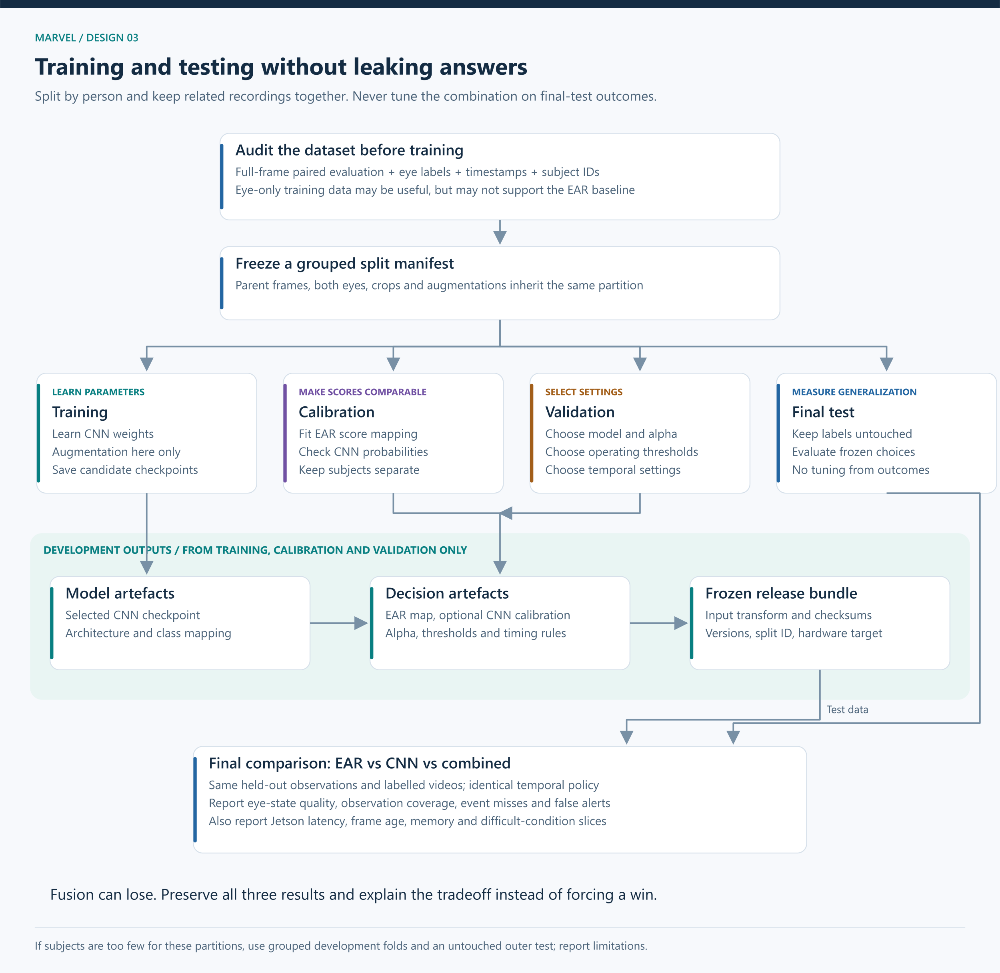

# MARVEL: EAR, CNN and Combined Drowsiness Monitoring

## System design and Phase 1 implementation guide

**Prepared:** 11 September 2026
**Status:** Proposed implementation specification. No detector, CNN, dataset, or Jetson runtime has been implemented or validated in this workspace.
**Audience:** Four beginners learning computer vision, ML integration and embedded deployment.

## 1. The decision we are making

We will implement and evaluate **three modes**:

1. **EAR only:** facial landmarks → Eye Aspect Ratio → eye-state decision.
2. **CNN only:** eye crops → trained convolutional neural network → eye-state decision.
3. **Combined:** valid EAR evidence and CNN evidence → a calibrated combination → eye-state decision.

Each mode feeds the same closure-duration and alert logic. We will build the two individual approaches first, then implement and test the combined approach. The combination is a required experiment; improved performance is a hypothesis, not a guaranteed outcome. All three modes remain available for demonstration and comparison even if fusion does not win.

This is a project-specific design. We borrow the baseline comparison principle from the F1 project, but the input representation, labels, temporal logic, metrics and deployment constraints are different.

**The CNN in the first experiment classifies each eye as open or closed.** It does not directly diagnose drowsiness. MAR remains in Phase 1 as a mouth-opening measurement and logged supporting signal. A separate mouth CNN and temporal yawn classification are later extensions unless the team explicitly expands Phase 1 again. A high MAR alone is not a yawn label.

### Confirmed constraints

| Item | Confirmed information | Design consequence |
|---|---|---|
| Team | Four people, little practical CV experience | Small modules, early integration, paired reviews |
| Development machines | Windows laptops with integrated webcams | Develop capture, inference, training and tests on Windows |
| Target | Original Jetson Nano, 4 GB RAM, Maxwell GPU | Check runtime compatibility and measure memory and latency early |
| Board access | About 3 to 4 hours per week | Prepare repeatable tests before every board session |
| Camera ordered | Raspberry Pi NoIR Camera Module V2 | Verify carrier-board cable and capture; evaluate actual NoIR images |
| Schedule | Initial target about two weeks; extension accepted for CNN and quality | Use evidence-based completion gates rather than declaring success on a date |
| Final speech | Local LLM and voice output planned | Keep speech outside the immediate alert path |

### Still unverified

Installed JetPack, Python and Ubuntu versions; available laptop GPU and memory; exact carrier-board revision; camera arrival and capture; dataset licences and labels; first required lighting conditions; numerical acceptance thresholds. These do not prevent architecture work, but they prevent claiming deployment compatibility or selecting exact installation versions.

## 2. Visual overview of the entire project



[Scalable SVG version](diagrams/01_entire_system.svg)

### How to read the architecture

**Development lane:** labelled examples are prepared on Windows. We train the CNN, fit score mappings, choose operating settings, and save a versioned release bundle.

**Runtime lane:** the camera produces observations. Perception locates the face and eyes. EAR and CNN estimate eye state. Temporal logic interprets the observation history. The alert controller produces an immediate warning and records the event.

**Speech lane, later:** a bounded queue delivers event summaries to a separate LLM worker. Generated text is checked and sent to text-to-speech. Invalid output, an expired event, or a timeout uses a fixed fallback or is discarded according to the event policy. Speech never determines whether the initial alarm is necessary.

**Evaluation lane:** labelled recordings are replayed into the same runtime components. Predictions are joined to ground truth by sample ID and timestamp. A separate evaluator computes results. Ground-truth labels never enter runtime prediction.

### Logical layers and their responsibilities

| Layer | Responsibility | Outputs |
|---|---|---|
| Perception | Capture, locate driver face, find landmarks, crop eyes, assess visibility | Images, named points, quality information |
| Cognition | EAR/MAR, eye-state estimates, fusion, history and alert decisions | State, evidence and events |
| Reasoning, later | Turn measured event context into a short sentence | Validated text |
| Actuation | Execute sound and later speech requests | Audible output and execution status |
| Observability | Record timing, errors, measurements and model identity | Logs and reproducible results |
| Training and evaluation | Learn parameters and measure generalization | Models, configuration, reports |

These are local Python modules and workers, not a requirement for microservices, a web backend or a cloud platform.

## 3. Phase 1 system design



[Scalable SVG version](diagrams/02_phase1_runtime.svg)

### Phase 1 must contain

1. Windows webcam and recorded-video input with timestamps.
2. Early Jetson environment and candidate inference checks.
3. Driver-face localization, facial landmarks and eye crops.
4. Shared image checks plus separate geometry and crop validity checks.
5. EAR and a documented MAR definition.
6. An EAR-only eye-state mode.
7. A trained eye CNN and a CNN-only mode.
8. Score mapping, fusion and a combined mode.
9. The same basic temporal trigger for all three modes.
10. An actual fixed sound on Windows; a separately testable Jetson output adapter.
11. Live overlays and structured measurement/event logs.
12. Reproducible image-level and video-level evaluation.
13. Model/configuration bundles and setup documentation.

### Explicitly later

Full PERCLOS processing, richer fatigue states, head-pose interpretation, mouth CNN and yawn-event classification, TensorRT optimization experiments, LLM generation, neural TTS and a polished dashboard. Basic duration tracking, recovery and invalid-data handling belong in Phase 1 even though the richer state machine comes later.

### The runtime sequence

| Step | Operation | Why it exists | Failure handling |
|---|---|---|---|
| 1 | Read frame and timestamp | Establish what was observed and when | Camera error; no old frame reused as new |
| 2 | Locate intended driver face | Avoid analyzing a passenger | Mark unknown if target is lost; reset identity-dependent history on target change |
| 3 | Find points and eye regions | Supply geometry and image inputs | Validate each eye and branch independently |
| 4 | Compute EAR/MAR and CNN scores | Produce the two kinds of evidence | Missing values remain missing, never zero |
| 5 | Select EAR, CNN or fusion mode | Make the experiment explicit | Fused mode requires both branches initially |
| 6 | Aggregate usable eyes | Convert per-eye observations into one driver observation | Initial policy requires both eyes; otherwise unknown |
| 7 | Update duration/recovery logic | Distinguish a brief blink from sustained closure | Long gaps break confirmed closure continuity |
| 8 | Emit transition event | Prevent a new alarm request on every frame | Event IDs, recovery and bounded repeat policy |
| 9 | Display and log | Make the result explainable and measurable | Preserve error reasons and run metadata |

**Comparison mode:** replay the same video through three separate tracker instances, one per method. The tracker code and timing settings are identical, but their internal state is not shared. Log all three; enable sound for only one selected mode so the comparison does not create overlapping alarms.

**Live mode:** select one method in configuration. Report its method name and bundle version on the display. Do not silently switch methods during an experiment.

## 4. What each algorithm does

### 4.1 EAR baseline

For six ordered eyelid points:

\[
EAR = \frac{\lVert p_2-p_6\rVert + \lVert p_3-p_5\rVert}{2\lVert p_1-p_4\rVert}
\]

The numerator adds two vertical eyelid gaps. Dividing by two averages them. Dividing by eye width makes the measurement less sensitive to uniform scaling.

**Implementation:** map the detector's indices to six named points for each eye; convert coordinates to pixels in the same frame; reject near-zero widths and invalid geometry; calculate left and right EAR separately; threshold each valid eye. Choose thresholds using development data, not final-test labels.

Normalizing x by image width and y by image height produces different axis scales. Convert both into pixel coordinates before Euclidean-distance calculations. If crops are resized anisotropically, do not calculate geometry from the distorted crop.

EAR is a geometric feature, not a probability. A low EAR suggests closure but can also result from pose or incorrect points. Guided person-specific normalization is an optional improvement after the global baseline. It must use a declared calibration protocol and may not adapt silently during suspected fatigue.

### 4.2 MAR measurement

Choose named inner-lip points and record the exact formula. One simple definition is average inner-lip vertical gap divided by inner-mouth width. Other MAR definitions use different sums or factors; thresholds cannot be copied between them.

Initially display and log MAR. Mouth opening alone must not trigger a drowsiness alarm. The same eye pipeline comparison should not be confounded by changing mouth rules between methods.

### 4.3 CNN classifier

**Training input:** an eye crop produced with a documented crop, resize, channel and normalization policy. **Target:** independently annotated open or closed state for that eye. Ambiguous, partly closed or unobservable examples need a declared labelling policy rather than forced binary labels.

Candidate choices:

| Candidate | Benefit | Drawback | Recommendation |
|---|---|---|---|
| Small custom CNN with convolution, pooling and a classification head | Easy to inspect; can be compact | Must learn visual features from the available eye data | Useful if pretrained model deployment is blocked or as a later comparison |
| Compact pretrained CNN, such as MobileNetV3-Small | Reuses learned visual features | Input requirements and exported operations must match runtime support | First candidate to investigate, not a confirmed deployment choice |
| Larger pretrained CNN | Potentially richer features | More memory, latency and integration cost | Not the first choice for Nano |

Train a replacement classification head first. Fine-tune selected backbone layers only if validation supports it. For a single-output binary model, use a logit and binary cross-entropy with logits. Apply sigmoid during inference to obtain a probability-shaped score. A two-output model can instead use cross-entropy; pick one convention and document it.

The training loop is: read labelled batches → forward prediction → loss → backpropagation → optimizer update → validation → save selected checkpoint. Training changes parameters; inference reads fixed parameters. Save the class mapping so open and closed cannot be swapped accidentally. See [PyTorch transfer learning](https://docs.pytorch.org/tutorials/beginner/transfer_learning_tutorial.html) and [Torchvision MobileNetV3](https://docs.pytorch.org/vision/stable/models/mobilenetv3.html).

Train and debug on Windows. Verify the selected architecture can run through a compatible Jetson runtime before investing in extensive tuning. PyTorch checkpoint creation does not itself establish Jetson deployment compatibility.

### 4.4 Combining EAR and CNN correctly

We will compare three possible fusion approaches before committing to the final one:

| Method | Mechanism | Advantage | Cost or failure mode |
|---|---|---|---|
| Agreement rule | Require both classifiers, or accept either classifier | Easy to explain | AND can miss closures; OR can increase false alerts |
| Calibrated weighted combination | Map both signals to compatible closed-eye scores; combine them | Small and interpretable | Needs separate calibration and tuning data; may not improve correlated errors |
| Learned fusion classifier | Learn a small classifier on branch outputs and quality features | Can learn conditional interactions | Adds parameters and needs held-out or out-of-fold branch predictions |

**Recommended first combined experiment:** calibrated weighted combination, after the standalone implementations work.

1. Fit a simple logistic mapping from valid EAR to closed-eye likelihood using the calibration partition. With one EAR input, constrain or check that increasing EAR does not increase predicted closure likelihood. Preserve the raw-threshold baseline separately.
2. Check CNN calibration; use a held-out temperature fit if justified. Do not treat every sigmoid score as a reliable probability.
3. For the same eye and observation timestamp, compute:

\[
p_{combined}=\alpha p_{CNN}+(1-\alpha)p_{EAR},\qquad 0\leq\alpha\leq1
\]

4. Select alpha and decision thresholds using validation data. Include alpha endpoints 0 and 1 so the search can conclude that an individual method is better.
5. Freeze the selected configuration before the final test. A weighted score is not automatically calibrated even if the inputs were calibrated; check reliability if it will be described as a probability.
6. Initially require both valid branches for combined mode. If either is unavailable, emit unknown. Any later fallback to a single branch must be explicit, logged and evaluated as a separate policy.

**Illustration only:** if EAR maps to 0.70, CNN gives 0.90, and alpha is 0.50, the combined score is 0.80. Neither these scores nor that alpha are measured project settings.

**Per-eye first:** calculate left and right outputs separately. An initial driver policy can classify bilateral closure when both valid eyes are classified closed, classify open only when both are open, and treat disagreement as ambiguous/unknown. This is conservative about mixed evidence and can reduce coverage. Tune and compare any alternative eye aggregation policy on development videos; keep it identical across methods for the initial experiment.

See [probability calibration](https://scikit-learn.org/stable/modules/calibration.html). A learned combiner must never be trained using base-model predictions produced on the same examples the base model memorized.

### 4.5 The minimal temporal controller

Runtime states: `OPEN`, `CLOSURE_PENDING`, `ALARM`, `UNKNOWN`. These are observable operational states, not clinical diagnoses.

| Input or condition | Controller behaviour |
|---|---|
| Valid closed observation following open | Start closure candidate using observation time |
| Continued valid closure with acceptable observation gaps | Accumulate confirmed sampled closure duration |
| Duration reaches configured threshold | Emit one prolonged-closure event |
| Valid reopening before threshold | Cancel the candidate |
| Invalid or stale data | Mark current observation unknown; do not count the gap as closed or open |
| Gap beyond configured tolerance or driver target changes | Break continuity and require fresh evidence |
| Valid reopening after an alarm | Require configured recovery duration before clearing the event |
| Unknown after an alarm | Preserve the outstanding event record; do not claim recovery |
| Persistent unknown | Emit a distinct monitoring-unavailable notification under a bounded policy |

Alarm history and present observation validity should be separate fields: the latest observation can be unknown while an earlier alarm is still outstanding. Audio duration and repetitions are controlled by an explicit bounded policy, not an endless frame-by-frame sound call.

Use a monotonic clock for live elapsed time. For recorded video, use media timestamps so playback speed does not change the result. Record wall-clock time separately for human-readable logs. Estimating continuity between samples requires a maximum accepted gap; do not imply continuous visual proof between arbitrarily spaced frames.

Two eye-state thresholds can add hysteresis. Keep closure/recovery timings common across EAR, CNN and fusion during the first comparison. Their numerical decision thresholds may be tuned separately on validation data.

## 5. Dataset and evaluation design



[Scalable SVG version](diagrams/03_training_evaluation.svg)

### Data required now

Data cannot wait until Phase 5. CNN training, calibration and honest fusion evaluation require it in Phase 1.

1. **Training examples:** labelled open/closed eyes with enough variation to train the classifier.
2. **Paired evaluation examples:** the same eye observations must support both geometry and CNN crops. Full-face frames or videos with eye labels are preferable. Tiny eye-only datasets may help CNN training but may not support the face-landmark baseline.
3. **Temporal recordings:** timestamps and independently annotated blink/prolonged-closure intervals. Static image labels alone cannot evaluate alert duration and delay.
4. **Target-camera samples:** actual webcam and later NoIR frames. Daylight grayscale conversions do not reproduce infrared imaging.
5. **Metadata:** subject, session, source, lighting, glasses, pose, label provenance, licence and acquisition conditions where available.

A four-person collection can support debugging and a limited demonstration; it is not enough by itself to claim broad generalization. Dataset selection is still open. Do not assume every dataset mentioned in the proposal has eye-level labels, subject identifiers or permission for the intended use.

### Suggested manifest fields

`sample_id`, `subject_id`, `session_id`, `video_id`, `timestamp_ms`, `frame_path`, `eye_side`, `eye_label`, `observable`, `lighting`, `glasses`, `source`, `split`, `label_version`.

Eye crops inherit the parent frame's subject and split. Both eyes from one person must remain in that person's partition. Keep the same frame ID when generating geometry and image inputs so predictions can be joined correctly.

### Split before crop generation or augmentation

| Partition | What it may influence | What it must not influence |
|---|---|---|
| Training | CNN weights | Final reported test performance through label access |
| Calibration | EAR score mapping and optional CNN score calibration | CNN weight fitting on the same samples |
| Validation | Architecture, threshold, alpha, recovery and runtime policy choices | Final test labels |
| Final test | Frozen comparison results | Any subsequent tuning presented as the same untouched test |

Group by subject first and keep sessions/clips together. Choose partition sizes based on the available number of subjects and class coverage, not a blind frame-percentage split. If separate partitions are too small, use grouped development folds and held-out predictions, with a genuinely untouched outer test. Explain the increased implementation complexity before using that route. See [grouped cross-validation](https://scikit-learn.org/stable/modules/cross_validation.html).

Use the same final-test examples for all predeclared methods. Select the deployment candidate using validation and resource checks before test evaluation. Reporting all three final-test scores is valid; changing the method using those scores requires a new holdout for a new unbiased claim.

Never label training data using the EAR rule and then claim the CNN beats EAR against those same labels. Review label ambiguity separately. Augment training data only; do not leak altered copies into other partitions.

### Evaluation at two levels

**Eye observation:** closed-eye recall, precision, F1, confusion matrix and invalid-observation rate. Compute conditional classifier metrics on jointly valid samples for an apples-to-apples classifier comparison; also report end-to-end coverage and all failures. Never hide failed crops by dropping them without accounting.

**Video event:** missed prolonged closures, detected events, false alerts per observed hour, onset-to-alert delay, valid observation coverage and behaviour during missing data. Predefine event matching: what overlap or onset tolerance counts, how duplicate alerts are counted, and whether alerts inside annotation uncertainty regions are excluded or reviewed. Do not treat repeated alerts for one event as multiple true positives.

**Performance:** capture rate, inference latency, full frame processing latency, frame age, p50/p95 latency, peak memory, device configuration and sustained-run stability. Combined mode must be timed with both branches active. EAR computation is cheap, but its landmark detector may not be.

**Slices:** each subject, glasses, lighting, pose and camera source. Report denominators. If sample size permits, estimate uncertainty by resampling subjects or sessions rather than treating adjacent frames as independent.

### Proposed completion criteria

These are proposed engineering gates, not existing results or a road-safety certification:

- [ ] Each mode loads its declared bundle and runs the same labelled replay.
- [ ] Correctly ordered landmarks and stable crops have been visually checked.
- [ ] EAR, CNN and combined results are recorded separately.
- [ ] Changing playback speed does not change event decisions.
- [ ] Missing frames do not count as confirmed closure or recovery.
- [ ] Normal blinks, sustained closure, winks, talking, head turns and absent faces have explicit expected outcomes.
- [ ] A sustained replay of at least 10 minutes completes without a crash, growing frame backlog or uncontrolled alert repetition.
- [ ] An initial latency budget is written before tuning. A possible lab target is p95 frame age below 500 ms; confirm or revise it explicitly for the demonstrated operating conditions.
- [ ] Event delay is measured against the configured closure duration plus processing delay, not quoted only as model FPS.
- [ ] Target recall and acceptable false alerts per hour are chosen after inspecting dataset annotation quality and before final testing. No arbitrary accuracy percentage is promised here.
- [ ] At least one Jetson capture/inference integration check is documented; full embedded Phase 1 completion requires all required modes to be tested on the target, with results or explicit unresolved blockers.
- [ ] Another teammate can reproduce the demonstration from the guide and versioned configuration.

If the CNN or fusion underperforms, the experiment is still informative. If it fails the agreed operational requirements, the build is not declared successful merely because training completed.

## 6. Drawbacks and how we will address them

| Drawback | Mechanism | Phase 1 mitigation | Later improvement or remaining limit |
|---|---|---|---|
| Person-dependent EAR | Normal eye geometry differs | Validate a global threshold across people; log per-person errors | Guided calibration with a frozen reference; avoid learning fatigue as normal |
| Landmark or crop failure | Pose, blur or obstruction corrupts input | Visual overlays, geometry checks, crop bounds and minimum resolution | Better localization or pose gating; invisible eyes stay unknown |
| Correlated errors | Both branches share sensor and localization | Record disagreements and shared failures; do not assume redundancy | Fusion only helps where errors are complementary |
| Training/deployment mismatch | Different camera, illumination or people | Source-separated evaluation and representative augmentation | Collect actual NoIR data; assess performance under that modality |
| Overfitting | CNN learns people, backgrounds or camera artefacts | Grouped splits, modest model, validation checkpoint selection | More representative data, not simply more epochs |
| Unreliable confidence | CNN scores are overconfident | Calibration diagnostics and explicit uncertainty policy | Recheck after deployment-domain changes |
| Fusion adds complexity without gain | Scores are redundant or tuning overfits | Predeclared standalone comparisons and alpha endpoints | Prefer a standalone deployed method if requirements allow; retain combined experiment |
| Blink false alarms | Single-frame decisions ignore duration | Timestamp-based candidate, recovery and repeat policy | Rolling closure statistics and richer temporal logic |
| Camera loss appears as recovery | Missing data is filled with zeros/open labels | Unknown state and gap reset; preserve event history | Monitoring-unavailable indication and independent system-health mechanisms |
| Two eyes disagree | Wink, occlusion or asymmetric prediction | Explicit per-eye outputs and ambiguous state | Validate a quality-aware aggregation policy separately |
| Mouth opening is mistaken for a yawn | Talking/laughing share static appearance | MAR is logged, not treated as sufficient alarm evidence | Labelled mouth sequences and yawn-event classification |
| Slow alerts despite good FPS | Queues accumulate old frames | Latest-frame buffer for live capture; frame-age logging | Optimize measured bottleneck; verify numerical parity after conversion |
| LLM blocks detection | Sequential inference or shared-resource overload | LLM absent from Phase 1 | Separate worker, bounded event queue, timeouts and fixed warning |
| Buzzer assumed independent | Same board/process controls output | Sound adapter reports failures; no guarantee claimed | Independent watchdog/hardware requires separate design |

NoIR needs illumination in darkness. Hardware placement, focus, exposure and reflections can dominate model choice. CLAHE is an experiment, not an automatic repair: it can amplify noise and alter the CNN input distribution. Apply identical preprocessing at training and inference, and measure any benefit.

## 7. Review of the proposed repository structure

**Verdict:** the subsystem grouping is useful, but the supplied tree does not implement the revised EAR + CNN + fusion Phase 1 scope.

| Supplied choice | Required revision | Reason |
|---|---|---|
| Capture and detection under perception | Keep, add crop and quality modules | Both branches depend on observable eye inputs |
| EAR/MAR under cognition | Keep | Clear mathematical responsibility |
| Only a naive threshold trigger | Add duration, unknown, recovery and bounded repeats now | A blink-only alarm is not an adequate usable baseline |
| No CNN module | Add architecture and inference components | CNN is mandatory in Phase 1 |
| No training or data preparation | Add offline scripts and dataset utilities | Training must be reproducible |
| No fusion | Add score mapping, calibration metadata and fusion | Combined experiment is mandatory |
| Models empty until Phase 3 | Store landmark assets and trained checkpoints in Phase 1 | Models already exist before optimization |
| Data empty until Phase 5 | Prepare manifests and split information immediately | Labels and holdouts precede training |
| Benchmarks only in Phase 3/5 | Add evaluation and profiling now | Comparison cannot be deferred until after selecting a winner |
| Logger in Phase 4/5 actuation | Move logging to observability in Phase 1 | Every experiment needs evidence |
| Main integration in Week 4 | Start main with the first webcam demo | Catch interface mismatches throughout development |
| Buzzer stub only | Windows sound plus a mock for tests; Jetson adapter separately | A stub proves wiring of software calls, not audible output |
| Single requirements.txt | Separate training and runtime environment specifications | Windows and Jetson have different binary dependencies |
| Empty future modules | Document future modules without implementing empty placeholders | Reduce beginner confusion about what works |

### Revised target tree

This is the planned tree. This documentation task creates the guide and diagrams only. Python modules are created incrementally as their checkpoint is implemented.

```text
marvel-drowsiness-detection/
├── pyproject.toml                   Package metadata; consistent src imports
├── README.md                        Setup and demo instructions
├── .gitignore                       Exclude environments, recordings and large outputs
├── configs/
│   ├── runtime.yaml                 Source, mode, thresholds, timing, quality policy
│   ├── training.yaml                Architecture, crop policy, loss, seed, optimizer
│   └── experiments.yaml             Splits, calibration, fusion search, metrics
├── environments/
│   ├── windows-training.txt         Tested and pinned laptop dependencies
│   ├── windows-runtime.txt          Tested laptop demo dependencies
│   └── jetson-runtime.md            Verified board versions and install procedure
├── src/
│   └── marvel/
│       ├── __init__.py
│       ├── main.py                  Integrate from checkpoint 1
│       ├── contracts.py             Frame, eye observation, estimate, event records
│       ├── perception/
│       │   ├── __init__.py
│       │   ├── capture.py           Webcam, video and Jetson capture adapters
│       │   ├── detection.py         Swappable face/landmark detector adapter
│       │   ├── crops.py             Eye extraction, alignment and bounds checks
│       │   └── quality.py           Shared and branch-specific validity checks
│       ├── cognition/
│       │   ├── __init__.py
│       │   ├── features.py          EAR and documented MAR
│       │   ├── ear_classifier.py    Raw EAR decision and optional score mapping
│       │   ├── cnn_architecture.py  Model definition shared by train and inference
│       │   ├── cnn_inference.py     Load once; predict valid eye batches
│       │   ├── fusion.py            Combine compatible scores with validity rules
│       │   └── trigger.py           Closure duration, gaps, recovery, events
│       ├── actuation/
│       │   ├── __init__.py
│       │   └── audio.py             Windows sound, mock, later Jetson adapter
│       ├── observability/
│       │   ├── __init__.py
│       │   ├── overlay.py           Face, crops, measurements, state, frame age
│       │   └── logger.py            Run metadata, observations and event records
│       └── training/
│           ├── __init__.py
│           ├── dataset.py          Manifest-backed labelled samples
│           └── transforms.py       Shared deterministic input transform; train augmentation
├── scripts/
│   ├── inspect_environment.py       Read-only environment report
│   ├── prepare_dataset.py           Validate manifest, groups, labels and crops
│   ├── train_cnn.py                 Offline training and checkpoint selection
│   ├── calibrate_scores.py          Fit mappings using calibration partition
│   ├── tune_fusion.py               Select alpha and settings using validation
│   ├── evaluate.py                  Image and event comparison with frozen settings
│   └── profile_runtime.py           Latency, frame age, memory and sustained run
├── data/
│   ├── README.md                    Sources, licences and acquisition instructions
│   ├── manifests/                   Versioned sample metadata and split definitions
│   ├── raw/                         Original authorised data, ignored by Git
│   ├── processed/                   Derived crops/features, ignored by Git
│   └── demo/                        Consent-based lab recordings, ignored by Git
├── models/
│   ├── README.md                    Asset sources and checksums
│   ├── landmarks/                   Pretrained localization assets
│   ├── checkpoints/                 CNN weights and training metadata
│   ├── calibration/                 EAR map, CNN calibration, selected alpha
│   └── exports/                     Later compatible runtime exports
├── reports/
│   └── runs/                        Run ID, config snapshot, logs, metrics and plots
├── tests/
│   ├── test_features.py             Known geometry, scaling, invalid inputs
│   ├── test_trigger.py              Timestamped scenarios, gaps and recovery
│   ├── test_fusion.py               Score direction, alpha endpoints, missing branches
│   ├── test_dataset.py              Subject split and sample-ID integrity
│   └── test_inference_contract.py   Saved preprocessing/class mapping and output shape
└── docs/
    ├── PHASE_1_SYSTEM_DESIGN.md      This guide
    ├── diagrams/                    PNG and editable SVG diagrams
    └── decisions.md                 One decision, evidence and consequence per entry
```

The `src/marvel` package with `__init__.py` avoids depending on the terminal's accidental working directory. `pyproject.toml` defines the package; install it into the chosen environment as part of setup. Exact setup commands follow the environment audit. Configuration and manifests contain metadata, not private recordings. Keep model weights outside ordinary Git history or use an agreed large-file mechanism.

Later add `cognition/perclos.py`, `cognition/pose.py`, richer temporal state logic, `reasoning/prompt_builder.py`, `reasoning/llm_inference.py` and `actuation/tts.py` when their phase begins.

## 8. Interfaces: how four people's code connects

| Record | Required fields | Producer → consumer |
|---|---|---|
| FramePacket | frame ID, source ID, image, observation time, receive time | capture → perception |
| EyeObservation | frame ID, eye side, pixel points, crop, geometry validity, crop validity, reasons | perception → EAR/CNN |
| EyeEstimate | frame ID, eye side, method, raw score, score meaning, valid flag, model version | EAR/CNN → fusion/controller |
| DriverObservation | observation time, selected method, bilateral state, validity, reasons | aggregation → controller |
| AlertEvent | unique ID, onset, detection time, reason, method, evidence, severity | controller → sound/log/later speech |
| RunMetadata | code revision, dataset split version, model checksum, config, hardware/software | launcher → evaluator/report |

Arrays and dictionaries are enough to prototype these contracts. Introduce dataclasses when the selected Python versions support the chosen implementation. Do not add a database or API just to pass values between local functions.

Initialize camera and models once. The per-frame loop calls them repeatedly. Do not reload a model or create a sound process for every observation. For live capture, keep a bounded latest-frame handoff if needed; for offline evaluation, process every requested sample deterministically and record any dropped samples.

### Planned function responsibilities

| Function | Plain-language job | Key check |
|---|---|---|
| `read_frame()` | Return a fresh image and its time | Failed capture never returns stale data as current |
| `detect_face()` | Locate intended face and landmarks | Identity/location policy is stable |
| `extract_eyes()` | Return bounded crops and named points | Crops match the correct frame and eye |
| `compute_ear()` | Translate the EAR formula into distances | Known geometry and invalid width |
| `predict_eye()` | Apply stored preprocessing and CNN | Correct class mapping and evaluation mode |
| `combine_scores()` | Apply saved mapping, alpha and validity | No mixing raw EAR with a probability |
| `update_trigger()` | Interpret valid observations over time | Frame-rate variation and gaps |
| `handle_alert()` | Execute one declared sound request | Deduplication and bounded repeat policy |
| `write_observation()` | Save measurements and reasons | Traceability to run and frame |

## 9. Tools and installation requirements

| Tool | Purpose | Where used | Installation decision |
|---|---|---|---|
| Python + virtual environment | Application and isolated dependencies | All laptops; compatible runtime on Jetson | Confirm versions first; do not replace Jetson system Python |
| OpenCV | Capture, image conversion, cropping and overlay | Windows and Jetson | Verify build capabilities; CSI requires suitable GStreamer support |
| NumPy | Arrays and geometry | Runtime and training | Pin tested compatible versions |
| MediaPipe Face Landmarker | Laptop landmark candidate | Windows first | Model asset plus library; Jetson compatibility unproven |
| dlib or another compatible detector | Alternative landmark backend | Conditional Jetson fallback | Compile/runtime and model licence checks before adoption |
| PyTorch + torchvision | CNN training and initial inference | Windows | Match installed Python and GPU driver; CPU possible but speed unknown |
| scikit-learn | Calibration, grouped splitting and metrics | Development | Not necessarily required in deployed runtime if mappings are exported |
| pandas | Manifests and results tables | Development | Keep outside the hot loop |
| Matplotlib | Curves, confusion matrices and comparisons | Development | Save plots with run IDs |
| pytest | Meaningful geometry/timing/data tests | Development | Test behaviour, not copies of implementation |
| YAML loader | Configuration | Development/runtime | Safe parsing and schema checks |
| Git | Collaboration and version history | All laptops | Small changes with reviewed interfaces |
| GStreamer/Argus | CSI capture | Jetson | Use packages compatible with installed JetPack |
| Jetson profiling tools | Memory, temperature and load | Jetson | Use tools available in the board image |
| ONNX/TensorRT | Conditional deployment and later optimization | Jetson | Early compatibility may require export; full optimization is later |

**Hardware:** Windows laptop webcam; available storage for datasets; optional compatible training GPU; powered and cooled Nano; microSD image; correct CSI cable; keyboard/display or a working remote terminal; speaker or correctly driven buzzer. Inspect the exact buzzer electrical requirements before GPIO wiring. A GPIO pin is a control signal, not a universal power supply for an arbitrary buzzer.

NVIDIA's JetPack 4.6.6 documentation describes the original Nano generation and an older Ubuntu/CUDA stack. A current Windows training environment does not imply the same packages run on it. Inspect the existing board installation and choose compatible system packages, wheels, source builds or containers. A virtual environment cannot replace incompatible drivers; a container still depends on host compatibility. [NVIDIA JetPack 4.6.6](https://developer.nvidia.com/jetpack-sdk-466).

MediaPipe's Python Face Landmarker uses a package plus a separate model asset. Keep that asset's origin and checksum. Do not assume examples for a different MediaPipe API version match your installation. [MediaPipe Python guide](https://developers.google.com/edge/mediapipe/solutions/vision/face_landmarker/python).

### Read-only environment inventory

On each Windows laptop, record Python version, interpreter location, RAM, webcam availability and GPU model/driver if present. On the Jetson, record board model, Jetson Linux release, OS, architecture, Python, memory, camera elements and OpenCV build information. Preserve exact errors. Do not fix installation problems by repeatedly installing unpinned packages into the system interpreter.

## 10. Implementation order and ownership

There is no Week 4 integration milestone. Integration begins with the first frame and continues after every step.

Current assignments were revised at Vishruth's request on 12 September 2026. Vishruth and Arushuuu jointly own most ML work. shamaa007 and niharika526 own independent runtime and tooling work under Vishruth's checkpoint review. See [the team guide](TEAM_START_HERE.md) for file ownership and beginner deliverables.

| Gate | Work | Owner / reviewer | Evidence before moving on |
| :--- | :--- | :--- | :--- |
| G0 | Environment inventory, dataset audit, contracts | Everyone inventories; both seniors own data decisions/contracts; niharika526 records board inventory | Known constraints, viable data plan, initial Jetson compatibility test booked |
| G1 | Main preview, capture, overlays, logs and fixed audio | shamaa007 owns capture/preview/overlay; niharika526 owns logs/audio; Vishruth reviews | Reproducible preview with timestamps and clean shutdown; synthetic records/events clearly marked |
| G2 | Landmark mapping, crops, EAR/MAR and validity | Vishruth / Arushuuu | Visual checks and geometry tests |
| G3 | EAR mode and minimal temporal trigger | Vishruth / Arushuuu | Blink, closure, gap and recovery replay tests |
| G4 | Grouped dataset manifest and CNN training | Arushuuu / Vishruth | Split audit, training/validation curves, loadable checkpoint |
| G5 | CNN mode using shared temporal logic | Arushuuu owns inference; Vishruth integrates | Same recordings evaluated; class/preprocessing parity checked |
| G6 | Score calibration and combined mode | Vishruth / Arushuuu | Held-out calibration, validation-selected fusion settings |
| G7 | Frozen three-method evaluation | Arushuuu owns evaluation; Vishruth reviews; niharika526 supplies profiling | Observation/event metrics, coverage, failures and resource costs |
| G8 | Target deployment and demonstration | Seniors own model compatibility; juniors own capture/output/tooling; Vishruth coordinates | All required modes tested on Jetson; reproducible handoff |

Senior ownership includes tests and experiment notes for each ML module. Junior ownership includes implementation, failure handling, tests and reproduction instructions for each runtime module. Synthetic observations unblock junior work before trained models exist; exclude them from accuracy evidence. Both seniors cross-review and reproduce the other's ML experiments. Everyone must be able to explain the entire pipeline.

### Initial two-week working target

**Week 1:** G0 to G3, with dataset work for G4 in parallel. First Jetson slot checks software, camera if available, and one landmark/CNN candidate on a saved input. Even an untrained architecture can test runtime operator compatibility; it does not prove accuracy.

**Week 2:** G4 to G6 and an initial G7 report if data and runtime gates are clear. The second Jetson slot tests the integrated candidate pipeline and logs actual timings. Do not claim all work fits this schedule before dataset and dependency checks.

**Extension if needed:** complete fusion validation, difficult-condition tests and G8. CNN and fusion are not dropped to preserve the two-week date. Extend based on named blockers and evidence, rather than adding unmeasured features.

### Prepare each 3 to 4 hour Jetson slot

- Bring a fixed sample image, short labelled video, selected model bundle and the expected laptop outputs.
- Inspect the environment before changing it.
- Check camera capture separately from model inference.
- Check one model prediction separately from the full application.
- Compare laptop and Jetson outputs on the same saved inputs within declared tolerances.
- Run the full pipeline and measure latency, frame age, memory and failures.
- Save commands, versions, logs and next blockers before leaving.

## 11. Learning checkpoints

For every module: define the behaviour → predict an example → implement one increment → explain its custom lines and library calls → test normal and failure cases → record one decision.

| Topic | What each teammate should be able to explain |
|---|---|
| Image arrays | Height, width, channels, BGR/RGB and crop coordinates |
| Detection vs recognition | Locating facial features versus identifying a person |
| EAR | Why vertical gaps are divided by eye width and why invalid points matter |
| CNN | Input pixels, labels, weights, loss, training, validation and inference |
| Calibration vs personalization | Score reliability mapping versus a person's normal opening reference |
| Fusion | Why raw EAR cannot be averaged with a probability |
| Temporal logic | Why 15 frames do not represent a fixed time at variable FPS |
| Evaluation | Why frames from one person must not leak across splits |
| Deployment | Why a model file and compatible runtime are both necessary |

**Interview description of the planned work:** We compare geometric EAR, a trained eye-image CNN, and calibrated fusion within the same temporal alert pipeline. We evaluate unseen subjects, observation coverage, false alerts and latency, then measure the selected configuration on a Jetson Nano. LLM speech is a later independent output stage.

**Decision record:** Use EAR, CNN and fusion as explicit experiment modes because the team requires both geometric and learned perception and needs evidence of their individual and combined value.

## 12. What this guide does and does not establish

This guide defines the architecture, build sequence, interfaces and validation plan. It does not establish dataset suitability, model accuracy, camera support, night operation, Jetson FPS or LLM feasibility. Those become measured results at their respective gates.

The immediate next implementation is **G0 and G1**: inspect environments, audit candidate datasets, agree on observation contracts, then create a small webcam/video preview with timestamps and logging. Do not generate the full application in one unexplained step.

## References

The original proposal and guide supplied by the team informed the goals. This document supersedes their Phase 1 scheduling where CNN training, fusion, logs and evaluation must now begin earlier.

1. [MediaPipe Face Landmarker for Python](https://developers.google.com/edge/mediapipe/solutions/vision/face_landmarker/python)
2. [PyTorch transfer learning tutorial](https://docs.pytorch.org/tutorials/beginner/transfer_learning_tutorial.html)
3. [Torchvision MobileNetV3 models](https://docs.pytorch.org/vision/stable/models/mobilenetv3.html)
4. [Scikit-learn probability calibration](https://scikit-learn.org/stable/modules/calibration.html)
5. [Scikit-learn grouped cross-validation](https://scikit-learn.org/stable/modules/cross_validation.html)
6. [NVIDIA JetPack 4.6.6](https://developer.nvidia.com/jetpack-sdk-466)

## Visual files

The PNG images render directly in this guide. SVG copies are scalable and editable. Keep this Markdown file and the `diagrams` folder together when sharing, or use the bundled ZIP.
